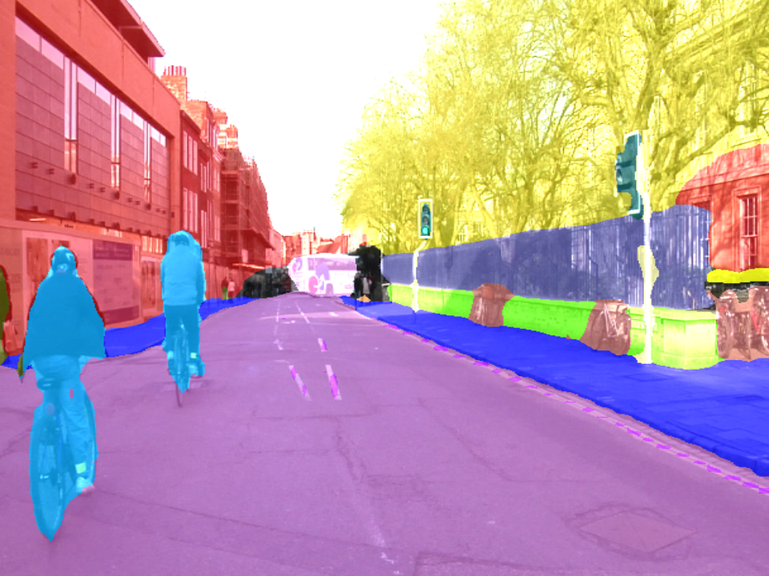

# Image-Segmentation

Keras impementation of BiseNet Image Segmentation Model (Paper : [Link](https://arxiv.org/pdf/1808.00897.pdf))

| Image	|  Semantic Segmentation    |Semantic_Video_Segmatnation(Youtube)|
|:-----------:|:----------:|:---------:|
| ||[](https://www.youtube.com/watch?v=cxAuoHRf1z4)| 

## Pretrained model
Pretrained Model Download ([Link](https://drive.google.com/file/d/1K6IDBBh-6vR49aV88TzvKq7OEXyem4ii/view?usp=sharing))

## Dataset  
Download CamVid dataset from [Semantic-Segmentation-Suite](https://github.com/GeorgeSeif/Semantic-Segmentation-Suite/tree/master/CamVid)  
Thanks [GeorgeSeif](https://github.com/GeorgeSeif) for his great job!

## File hierarchy
Once you download pretrained model and dataset, please follow this project structure:

    ├── "data"                   
    |   ├── train
    |   ├── train_labels
    |   ├── val
    |   ├── val_labels
    |   ├── test
    |   ├── test_labels
    |── "model.h5"   
    
## Support
**Prediction supports the following file formats : (Video : Mp4, Picture : .png)**

## Requirements for loading pretrained model
3 <= Python < 3.6 (Please note that python serialization algorithm is changed from v3.6+, and you can't load the pretrained model if you use Python 3.6+)


### Model prediction arguments

```
mandatory arguments:
  -media MEDIA_DIR, --media_dir MEDIA_DIR
                        Media Directorium for prediction (mp4,png)
optional arguments:
  -save SAVE_DIR, --save_dir SAVE_DIR
                        Save Directorium
  -model MODEL_DIR, --model_dir MODEL_DIR
                        Model Directorium
```

### Example semantic Image segmentation : 

```
python predict.py -media test_img.png
```

### Example semantic Video segmentation :
```
python predict.py -media test_video.mp4
```


## Model training arguments:

```
optional arguments:
  -eph EPOCHS, --epochs EPOCHS
                        Number of epochs
  -lr LEARNING_RATE, --learning_rate LEARNING_RATE
                        Learning rate
  -save MODEL_DIR, --model_dir MODEL_DIR
                        Save checkpoints directory
  -batches BATCH_SIZE, --batch_size BATCH_SIZE
                        Number of batches per train
```                        

### Example training:
```
python train.py
```


